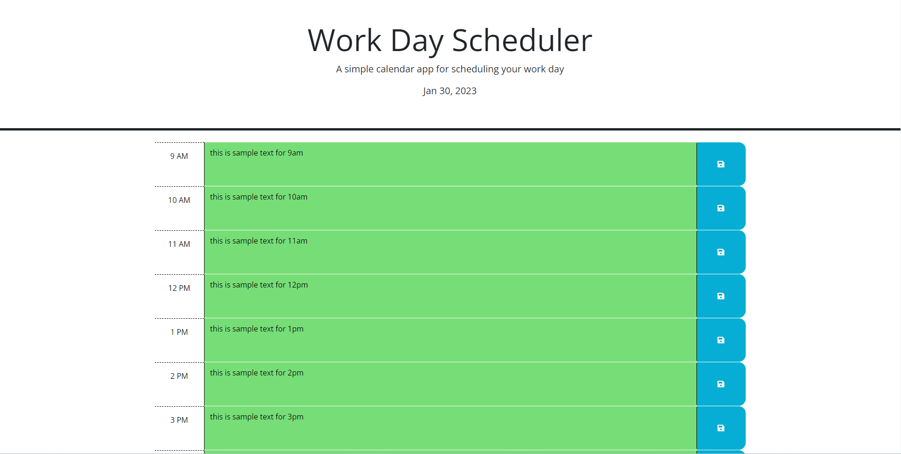

# Work Day Scheduler

## Description 
This project is a web page that allows you to input events into a time sheet and save them, when the time on the sheet is   past tense the text area will turn gray, when it is current the text area will turn pastel red, when the time is future tense the text area will turn green. 

## Dependencies
Any web browser
Any OS

## Installing 
N/A

## Executing Program
N/A

## Authors 
Blayne Fuller
UW bootcamp resources

## License
Refer to the github repository for licensing 

## Acknowledgments 
https://chat.openai.com/auth/login 
https://day.js.org/docs/en/display/format

## Preview

## Live URL 
https://blayne-04.github.io/work-day-scheduling/